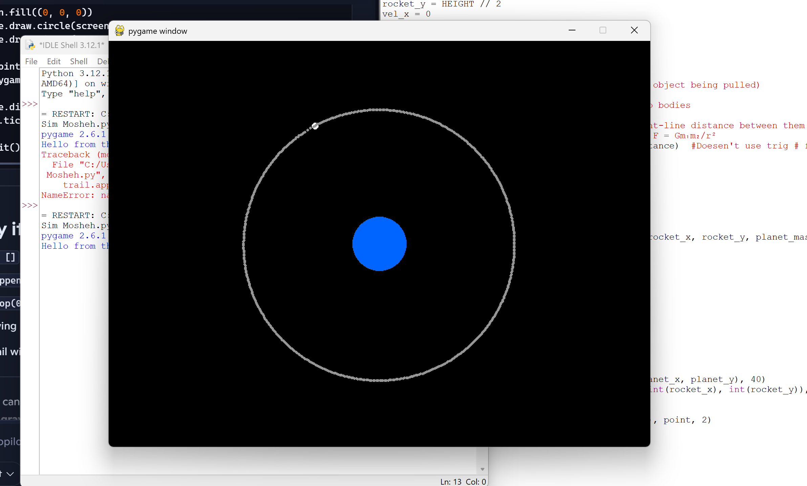

# Halfway

Date: July 27, 2026
Notes: 1. Newton’s Gravitational Equation
F = G × m₁ × m₂ ÷ r²
This determines how strong gravity is based on mass and distance.
2. Euler Integration
I learned that motion is updated step‑by‑step:
• Gravity changes velocity
• Velocity changes position
This repeats every frame (60 FPS), creating smooth motion.
3. Trig → Unit Vector Upgrade
I replaced the old trig‑based gravity direction with a cleaner, faster unit‑vector method.
This made the code simpler.
4. Orbit Trails (Major Improvement)
I added orbit trails to visualise the rocket’s path.
This makes the simulator look more scientific and helps me analyse orbit stability.
Phase: Overall Code

